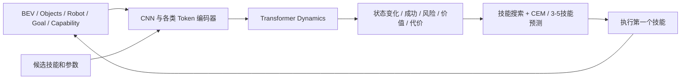

# 世界模型目标框架与首个离线基线

日期：2026-09-15。本阶段基于9c069e4开发，最新发布以实际Git历史为准，实验版本由数据与源码hash绑定。三份低层actor冻结，当前只新增世界模型的离线学习和评估。

本页MLP阶段已随a748e53发布，以下数字保留为历史对照。后续单个BEV/对象Transformer、千级数据与同信息残差MLP对照见 [对象模型v2](OBJECT_WORLD_MODEL_V2_CN.md)；v2仍未接入在线控制，也尚未实现ensemble。

## 1. 原方案目标

原方案定义的是对象中心、技能级动力学模型，详见 [原始设计第6节](RECONFIGURABLE_NAVIGATION_PLAN_CN.md#6-世界模型)。一次预测跨越一次完整技能的执行边界，而不是预测下一个20ms关节动作或生成视频。

| 输入 | 原设计 |
| --- | --- |
| Semantic BEV | 8x128x128，5cm分辨率，表达占据、高度、地面、支撑、可移动性、语义、置信度和空间提示 |
| Object Tokens | 初始32x16，保留对象中心、尺寸、类别、可移动/支撑属性和有效性 |
| Robot / Goal / Capability | 分别12/4/8维，独立编码 |
| Action | 技能类别、对象/支撑指针与连续目标参数 |

BEV经过3-4层CNN编码为128/256维空间特征；对象经过Object Transformer，保留每个对象token；Robot、Goal、Capability和Action分别编码。各token进入4-6层Transformer dynamics，输出机器人及相关对象状态增量、技能成功、碰撞、支撑稳定、终态、可达/价值和代价头。



计划训练3-5个独立模型构成ensemble，用模型分歧辅助估计认知不确定性；低分歧不等于安全。规划先通过几何与能力约束过滤候选，再按任务成功、风险、成本和不确定性排序，每次只执行第一个技能并重新观测。VLM负责提案，几何模块负责目标落地，executor和低层策略负责真实执行。

训练使用真实技能边界转移、失败和反事实候选，状态/代价用Huber类损失，概率头用BCE或Focal Loss；未知标签使用mask。原16维对象规格没有完整包含当前物理任务所需的yaw、速度、质量和摩擦，后续必须显式升级schema，不能无版本地扩维。全局不可达缺乏可靠负标签时，优先预测指定后续策略的任务成功率。

## 2. 本轮实际实现

[N3实施顺序](RECONFIGURABLE_NAVIGATION_NEXT_PLAN_CN.md#8-n3特权状态世界模型) 明确先做静态/运动学及小型MLP基线，验证数据、单位和评估，再实现完整Transformer。本轮完成的是这一步。

代码在 [world_model](../mujoco/reconfigurable_navigation/world_model/)；训练入口为 [train_skill_world_model.py](../mujoco/train_skill_world_model.py)。采用单箱与单平台专用 `box_support_tabular_v1`，不等同于原32对象token接口。

- 输入92维，只读取技能起点信息：机器人状态、相对对象/目标状态、候选动作、前序技能、已完成操作、能力、特权摩擦及已知预算。不读取终态、结果、场景ID、seed或split。
- 网络为92 -> 64 -> 64，使用SiLU，输出12个回归量和3个概率logit。
- 回归量是机器人/箱体XYZ增量、yaw增量的sin/cos、技能耗时和总尝试耗时的log1p。
- 概率头为技能成功、控制边界采样到的非法碰撞、指定规则后续任务成功。没有将unknown当作不可达来训练全局reachability头。
- 拒绝请求不生成动力学样本；截断不监督终态和完整耗时。归一化只拟合train，按validation早停，test仅用于最终评估。

本轮没有BEV编码器、对象Transformer、ensemble或学习模型闭环规划。能力、质量和摩擦在这批数据中范围固定，不能据此声称学习了任意能力/物理范围。

## 3. 数据与结果

六个既定布局各采新seed600/601，12回合8成功，保存48个技能起点。每点5请求，共240条：171技能成功、21物理失败、48拒绝。192条实际执行样本用于建模，PUSH48、NAV72、CLIMB72，train/validation/test分别80/64/48，按场景族分组。

固定seed7，最多300轮，AdamW学习率0.001、权重衰减0.001、batch32；validation耐心40轮，选择第15轮。统计基线仅用train，按技能和目标类型计算状态/耗时均值及平滑成功概率。

| 测试指标 | MLP | 统计基线 |
| --- | --- | --- |
| 机器人位置RMSE | 0.218m | 0.103m |
| 箱体位置RMSE | 0.179m | 0.077m |
| 技能成功AUROC | 0.959 | 0.900 |
| 技能成功Brier | 0.119 | 0.113 |
| 规则任务成功Brier | 0.150 | 0.145 |
| 总尝试耗时MAE | 5.062s | 4.800s |
| 离线选择候选的实际任务成功数 | 8/12 | 10/12 |

当前测试候选集中最优可观察结果为11/12，不是穷尽物理Oracle。离线分数固定为任务概率减碰撞概率，再减0.001倍尝试耗时；统计基线同类候选同分时取第一个，即reference。

结论：这份MLP是可复现的失败对照，位姿精度和候选选择未优于基线，不能接管规划。AUROC较高不代表概率已校准或规划选择可靠。当前12测试起点也不足以给出泛化和安全结论；后续改进应在validation上进行，并保留新的最终测试起点。

## 4. 产物与复现

本地 `/home/yuanyue/re-nav/artifacts/world-model-v1-20260915/`，服务器 `/mnt/yuanyue/data/world-model-v1-20260915/`。`model-seed7/` 包含 `model.pt`、`report.json`、`predictions.jsonl`；数据在 `candidates/manifest.json` 和配套JSONL。48个完整物理快照仅保留在服务器，模型和数据都不纳入Git。

10项编码/模型/指标/数据校验检查通过；加载器校验来源与文件hash、同源分组和冻结teacher契约。本地模型保存恢复预测完全一致；服务器权重hash一致，全部192条预测在rtol1e-5/atol1e-6内复现。

```bash
python mujoco/check_world_model.py
python mujoco/train_skill_world_model.py \
  --manifest /mnt/yuanyue/data/world-model-v1-20260915/candidates/manifest.json \
  --output-dir /mnt/yuanyue/data/world-model-v1-20260915/model-reproduction \
  --seed 7 --epochs 300 --patience 40 --hidden-size 64 --batch-size 32
```

使用隔离的MuJoCo/PyTorch环境即可，小模型在CPU训练；输出目录必须不存在。权重包含schema、编码源码hash、归一化buffer、teacher/data来源和支持范围，加载使用 `weights_only=True`。后续优先诊断表示、损失权衡和数据覆盖，再按目标路线推进对象Transformer与ensemble；当前规则Oracle及安全检查保持控制权。